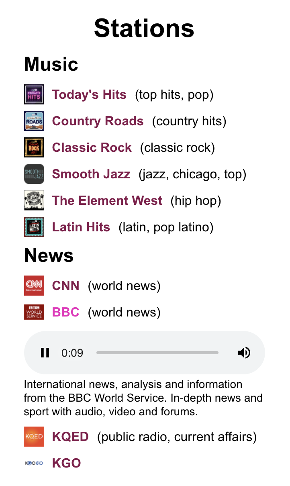

# Sample stations selector
This application is built with React and uses Mini TuneIn API.
It presents stations split into two categories: music and news. The stations in each category are sorted by their popularitym, with the most popolar shown on top.

Here is a screenshot:

  

## Viewing the app
In the project directory run:
### `npm start`
and open [http://localhost:3000](http://localhost:3000) to view it in the browser.

